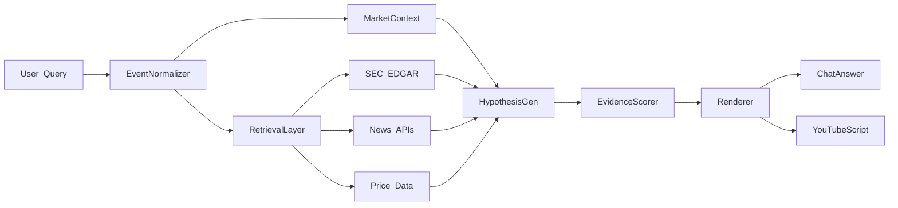

# AI Agent Research: Stock Drop Attribution

## Problem Definition

When a stock experiences a significant price drop (e.g., -20%), investors need to understand *why* it happened. The challenge is:

- **Multiple simultaneous events**: Filings, news, earnings, macro moves often coincide
- **Noisy information**: Not all events are price-relevant; headlines can be misleading
- **Incomplete data**: After-hours moves, unreported events, delayed filings
- **Attribution ambiguity**: Was it company-specific, sector-wide, or market-driven?

**Goal**: Build an AI agent that produces **ranked, evidence-backed hypotheses** with **explicit probabilities** and **strict citations**, avoiding hallucinations.

## Approach: Retrieval-Augmented Hypothesis Ranking

We use a **retrieval-first, LLM-assisted** pipeline rather than pure generation:

### Core Workflow

1. **Event Normalization**
   - Validate ticker, confirm drop magnitude, adjust for splits/dividends
   - Detect session type (regular, pre-market, after-hours)
   - Calculate volume vs. average

2. **Market/Sector/Peer Decomposition**
   - Compare stock return to market index (S&P 500), sector ETF, peer basket
   - Classify as: `company_specific`, `sector_wide`, `market_wide`, or `mixed`

3. **Evidence Retrieval** (time-aligned)
   - SEC EDGAR: 8-K, 10-Q, 10-K, S-3/ATM offerings
   - News: headlines from major wires (Reuters, Bloomberg) + outlets
   - Macro: CPI, jobs, rates if relevant

4. **Hypothesis Generation & Scoring**
   - Cluster evidence by theme (dilution, earnings miss, lawsuit, etc.)
   - Score each hypothesis using:
     - **Timing**: proximity to drop start
     - **Authority**: source credibility (filing > wire > outlet)
     - **Specificity**: company-specific vs. generic
     - **Magnitude plausibility**: does this event type explain a -20% drop?
     - **Corroboration**: multiple independent sources?
   - Convert scores to **explicit probabilities** (normalized across top hypotheses)

5. **Response Formatting**
   - **Chat answer**: ranked causes, timeline, citations, unknowns, next steps
   - **YouTube-style script**: hook → what happened → receipts → most likely → unknowns → watch next

## Evidence Policy (Strict Citations)

- **Facts must cite sources**: Every claim about filings, news, prices must include a link
- **Hypotheses labeled explicitly**: "Hypothesis (p=0.35, confidence=medium)"
- **Unknowns stated clearly**: "No 8-K filed in the 48-hour window"
- **No guessing**: If evidence is thin, say "unknown from available sources"

## Scoring Rubric

| Factor | Weight | How It's Calculated |
|--------|--------|---------------------|
| Timing | 35% | Decay function: 1.0 if ≤6h, 0.8 if ≤24h, 0.5 if ≤72h |
| Authority | 25% | SEC filing=0.95, wire=0.90, major outlet=0.80 |
| Specificity | 20% | Company-specific event > sector-wide > macro |
| Magnitude | 15% | Dilution can explain -20%; news varies |
| Corroboration | 5% | Multiple sources increase score |

**Probability assignment**: Top hypotheses' scores are normalized to sum ≤1.0; remainder = "unknown/other"

## Baseline Comparison

- **Naive baseline**: Show latest headline
- **Our method**: Ranked hypotheses with timing, authority, and plausibility weighting

## Evaluation Plan

### Dataset
- Collect 10–20 historical drops (-15% to -30%) with **known catalysts**
- Examples:
  - Regional bank selloff (March 2023): SVB earnings warning
  - Tech stock offering: dilutive S-3
  - Earnings miss: guidance cut in 8-K

### Metrics
1. **Top-1 / Top-3 match**: Does the correct cause appear in top 1 or top 3 hypotheses?
2. **Citation correctness**: % of factual claims with valid links
3. **Hallucination rate**: Factual claims with no supporting evidence
4. **Latency**: Time to retrieve + score + render

### Success Criteria
- Top-3 match ≥80% on test set
- Citation correctness 100% (strict)
- Hallucination rate <5%
- Latency <10s for typical query

## Safety & Quality Guardrails

- Never assert causation without evidence
- Avoid defamatory language
- Clearly label hypotheses vs. facts
- Disclaimer: "Not financial advice; for educational purposes only"

## YouTuber-Style Explanation (Blend)

We emulate a blend of:
- **Ticker Symbol: YOU**: Data-driven, explanatory, teach concepts
- **Tom Nash**: Direct, skeptical, show the receipts first
- **Atrioc**: Timeline/story-driven, punchy hooks
- **Felix & Friends**: Roundup multiple angles, macro context

### Script Template Structure
1. **Cold Open** (10-20s): Shock stat + "Here are the receipts..."
2. **What Happened** (30s): Numbers (price, volume, session)
3. **Zoom Out** (30s): Market/sector/peer context
4. **The Receipts** (2-3min): Show filings/news with links
5. **What's Most Likely** (1-2min): Ranked hypotheses with probabilities
6. **What We Don't Know** (30s): Explicit unknowns
7. **What to Watch Next** (30s): Verification steps
8. **Outro** (10s): Bottom line + disclaimer

## Future Enhancements

1. **Video Ingestion** (YouTube URLs)
   - Extract transcript → identify style patterns → extract claims
   - Verify claims via EDGAR/news before surfacing
   - Store as "leads" not "facts"

2. **Expanded Data Sources**
   - Earnings call transcripts (AlphaVantage, Polygon)
   - Analyst reports (Benzinga, Seeking Alpha)
   - Options flow (unusual activity)
   - Social sentiment (Reddit, Twitter via APIs)

3. **LLM Integration** (optional)
   - Use GPT-4 for summarizing long filings
   - Extract key quotes from 8-K items
   - Generate plain-English explanations of complex events

## Implementation Stack

- **Backend**: Python + FastAPI (async, type-safe)
- **Data**: SEC EDGAR (free), Yahoo Finance (free), news APIs (free tier)
- **Frontend**: Next.js (TypeScript, modern UX)

## References

- SEC EDGAR API: https://www.sec.gov/edgar/sec-api-documentation
- Yahoo Finance (unofficial): https://query1.finance.yahoo.com
- Research: "Explainable AI for Finance" (various papers on causal attribution)
