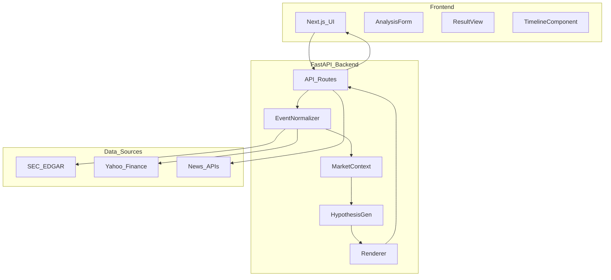

# Stock Drop Agent - Architecture

## Overview

The Stock Drop Research Agent is a web application that explains significant stock price drops using strict evidence citations, explicit probability estimates, and YouTuber-style explanations.

## System Architecture

## Component Breakdown

### Backend (Python FastAPI)

#### 1. **EventNormalizer** (`app/agent/normalizer.py`)
- **Purpose**: Validate and normalize stock drop events
- **Responsibilities**:
  - Fetch OHLCV data for the time window
  - Detect if drop is real (not a split/dividend)
  - Calculate volume vs. average
  - Determine session type (regular/pre/after hours)
- **Dependencies**: PriceClient

#### 2. **MarketContextAnalyzer** (`app/agent/market_context.py`)
- **Purpose**: Decompose the move into market/sector/company components
- **Responsibilities**:
  - Compare stock return to S&P 500, sector ETF, peers
  - Classify move type: `company_specific`, `sector_wide`, `market_wide`, `mixed`
  - Generate interpretation text
- **Dependencies**: PriceClient

#### 3. **HypothesisGenerator** (`app/agent/hypothesis.py`)
- **Purpose**: Generate and score hypotheses from evidence
- **Responsibilities**:
  - Cluster evidence by theme (dilution, 8-K, news, etc.)
  - Score each hypothesis using timing, authority, specificity, magnitude, corroboration
  - Assign explicit probabilities (normalized scores)
  - Build timeline from evidence
- **Scoring Weights** (configurable in `config.py`):
  - Timing: 35%
  - Authority: 25%
  - Specificity: 20%
  - Magnitude: 15%
  - Corroboration: 5%

#### 4. **ResponseRenderer** (`app/agent/renderer.py`)
- **Purpose**: Format responses in chat and YouTube-style script modes
- **Responsibilities**:
  - Build `AnalysisResponse` (chat mode)
  - Build `ScriptResponse` (YouTube mode)
  - Apply YouTuber-style narration template:
    - Hook → What Happened → Zoom Out → Receipts → Most Likely → Unknowns → Watch Next → Outro

#### 5. **Retrieval Clients** (`app/retrieval/`)
- **EdgarClient**: Search SEC filings (8-K, 10-Q, 10-K, S-3) via SEC EDGAR API
- **PriceClient**: Fetch OHLCV data, calculate drops, volume ratios
- **NewsClient**: Search news headlines (placeholder; needs API key for production)

#### 6. **API Routes** (`app/api/routes.py`)
- **POST /api/analyze**:
  - Input: `{ticker, drop_percent?, time_window_hours?}`
  - Output: `AnalysisFullResponse` (chat + script)
  - Orchestrates: Normalize → Retrieve → Contextualize → Score → Render

### Frontend (Next.js TypeScript)

#### Components (to be built)
1. **AnalysisForm**: Input for ticker, drop %, time window
2. **ResultView**: Display chat answer or script
3. **TimelineComponent**: Visual timeline of events
4. **API Client** (`lib/api.ts`): Fetch from FastAPI backend

### Data Models (Pydantic)

All models defined in `app/models/schemas.py`:

- **AnalysisRequest**: User input
- **AnalysisResponse**: Chat-mode output
- **ScriptResponse**: YouTube-mode output
- **Hypothesis**: Single ranked explanation (title, probability, confidence, evidence, mechanism, confirmation_check)
- **Evidence**: Single piece of evidence (timestamp, source_type, source_url, headline, snippet, authority_score)
- **TimelineEvent**: Event in chronological order
- **MarketContext**: Market/sector/peer comparison

## Data Flow (Example)

### User Query: "Why did AAPL drop 20%?"

1. **Frontend** → POST `/api/analyze` → `{ticker: "AAPL"}`
2. **EventNormalizer**:
   - Fetch AAPL price data (last 24h)
   - Confirm -20% drop
   - Calculate volume ratio (e.g., 3.2x average)
   - Session type: "regular"
3. **MarketContextAnalyzer**:
   - S&P 500: -0.5%
   - Tech sector (XLK): -1.2%
   - Peers: -1.0%
   - → Move type: `company_specific`
4. **Retrieval**:
   - EDGAR: Find 8-K filed 2 hours before drop (guidance cut)
   - News: Reuters headline "AAPL lowers revenue forecast"
5. **HypothesisGenerator**:
   - Hypothesis 1: "Guidance Cut (8-K)" → score=0.82 → p=0.65, confidence=high
   - Hypothesis 2: "Negative News Coverage" → score=0.41 → p=0.35, confidence=medium
6. **ResponseRenderer**:
   - Chat: Ranked causes + timeline + citations
   - Script: 7 sections with narration
7. **Frontend** ← JSON response → Display results

## Deployment Strategy

### Development
- Backend: `uvicorn app.main:app --reload` (port 8000)
- Frontend: `npm run dev` (port 3000)

### Production (Future)
- Backend: Docker + Cloud Run / AWS Lambda
- Frontend: Vercel / Netlify
- Database (optional): PostgreSQL for caching evidence

## Configuration

All settings in `app/config.py`:
- API timeouts
- Rate limits
- Scoring weights
- Data source URLs

## Testing Strategy

1. **Unit tests**: Each agent component (normalizer, scorer, renderer)
2. **Integration tests**: Full `/api/analyze` flow with mock data
3. **Historical validation**: Test against 10-20 known drops with ground truth

## Security & Privacy

- No user data persistence (stateless API)
- Rate limiting on `/api/analyze` to prevent abuse
- SEC EDGAR requests include User-Agent per SEC requirements
- Disclaimer in every response: "Not financial advice"

## Future Architecture Enhancements

1. **Caching Layer** (Redis): Cache EDGAR filings, price data
2. **Background Jobs** (Celery): Async evidence retrieval for slow sources
3. **Video Ingestion Pipeline**:
   - YouTube transcript → Style extraction → Claim verification → Evidence store
4. **LLM Integration** (optional):
   - Summarize long 8-K filings
   - Extract key quotes from transcripts
   - Generate plain-English mechanism explanations

## Tech Stack Summary

| Layer | Technology | Why |
|-------|-----------|-----|
| Backend | Python 3.11 + FastAPI | Async, type-safe, auto-docs |
| Frontend | Next.js 14 + TypeScript | Modern React, SEO-ready, API routes |
| Data | SEC EDGAR + Yahoo Finance | Free, authoritative sources |
| Validation | Pydantic | Runtime type checking |
| Testing | pytest + pytest-asyncio | Async-aware testing |

## Performance Targets

- API latency: <10s for typical query
- Concurrent requests: 10-50 (rate-limited)
- Evidence retrieval: <5s for EDGAR + prices

## Monitoring (Future)

- Log all queries with response times
- Track citation correctness (manual spot-checks)
- Alert if hallucination detected (factual claim with no evidence)
